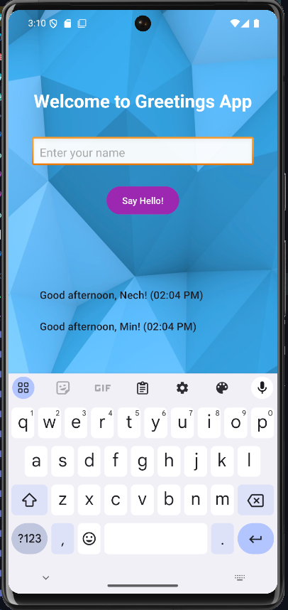

# 👋 GreetingApp (Java + Android)

GreetingApp is a simple and fun Android app built using **Java** that greets users based on the **time of day** and stores a **history of greetings**.

> 🌅 "Good morning, Alice!"  
> 🌇 "Good evening, Bob!"  
> ✅ And you can scroll back through your greeting history!

---

### 📱 Features
- 🕒 **Time-Based Greetings**  
  Displays greetings based on the current hour of the day.
- 📝 **Greeting History List**  
  Shows a scrollable list of all your past greetings with timestamps.
- 💾 **Persistent Storage**  
  Keeps your history even when you close the app (using `SharedPreferences`).
- ✨ **Modern, Clean UI**  
  Responsive layout with background image and dynamic greeting updates.

---

### 🚀 Getting Started

### Requirements
- Android Studio (latest recommended)
- Android SDK 21+
- Java or Kotlin (Java used in this version)

### Run the Project
1. Clone the repository:
   ```bash
   git clone https://github.com/Minkeez/Java-Android-GreetingApp.git
   ```
2. Open with Android Studio
3. Run the app on an emulator or physical device

---

### 📸 Screenshots


---

### 🛠️ Built With
- Java (Android)
- XML Layouts
- RecyclerView
- SharedPreferences
- ConstraintLayout

---

### 🙌 Author
Made with ❤️ by [Minkeez](https://github.com/Minkeez)
Follow me on GitHub

---

### 📌 Future Features (Coming Soon!)
- 🎤 Text-to-Speech greetings
- ⚙️ Settings screen
- 🎂 Birthday surprises
